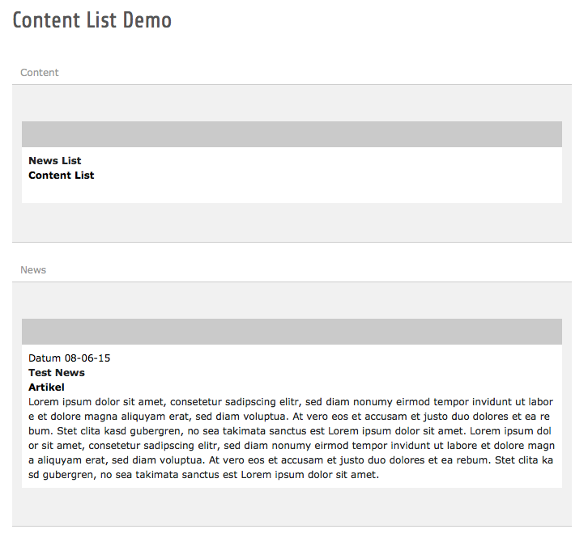

.. ==================================================
.. FOR YOUR INFORMATION
.. --------------------------------------------------
.. -*- coding: utf-8 -*- with BOM.

.. include:: ../Includes.txt

What does it do?
================

Create any kind of Lists from standard tt_content.
Content can be created and Edited in the Page Module.

Lists can look like tt_news Lists on a Page, or show Banners/Teasers selected by flexible rules as global Lists.

Use Case: Local tt_news style List on a Page
--------------------------------------------

* Create a Listplugin on a Page.
* Put tt_content Articles in a Column that is designated for your List.
* Get a List of your Artikles with Paging.
* Every Article has its own Detail Page.

	Page Module with List and Article

	Articles can be placed in a custom Column
